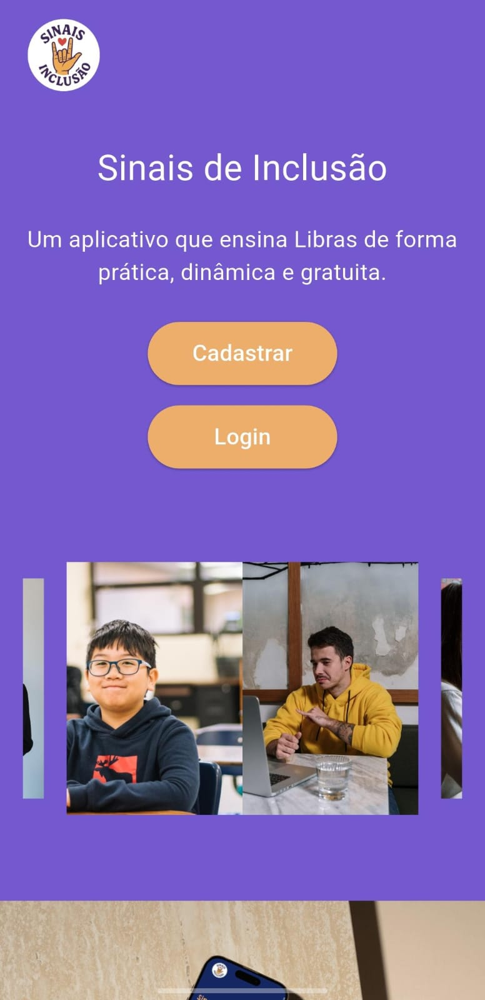
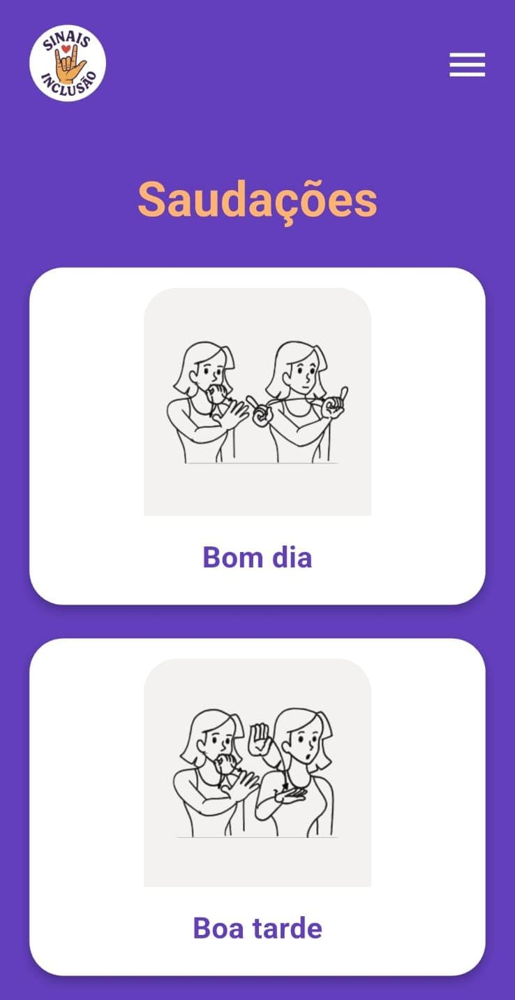
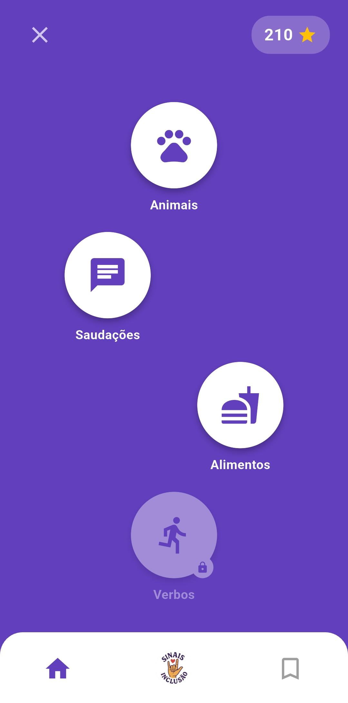
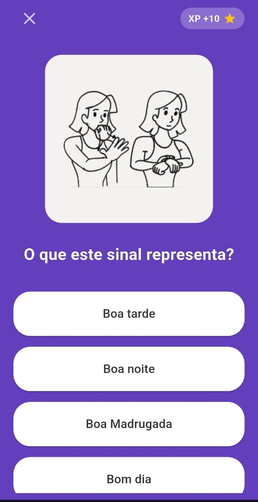

# 🤟 Sinais de Inclusão

<p align="center">
  
  
</p>

> **Sinais de Inclusão** é um aplicativo mobile multiplataforma desenvolvido em Flutter, projetado para democratizar o aprendizado da Língua Brasileira de Sinais (Libras). O diferencial do projeto é ir além do ensino do alfabeto e vocabulário isolado: o foco é introduzir o usuário na cultura surda e nas expressões utilizadas no cotidiano.

---

## 📱 Sobre o Projeto

O aplicativo foi idealizado para promover a acessibilidade e a inclusão digital, permitindo que pessoas ouvintes e surdas se conectem de forma mais natural no dia a dia. Através de uma interface limpa, intuitiva e moderna, os usuários navegam por módulos práticos de aprendizado.

### 🌟 Funcionalidades Principais (Protótipo Inicial)
*   **Módulos Interativos de Aprendizado:** Lições estruturadas para guiar o usuário desde os conceitos básicos até expressões mais elaboradas.
*   **Cultura e Expressões do Cotidiano:** Espaço dedicado a contextualizar os sinais com as gírias, expressões e a rica cultura da comunidade surda.
*   **Interface Responsiva:** Telas otimizadas para diferentes tamanhos de dispositivos móveis, priorizando a usabilidade e a acessibilidade visual.

---

## 🛠️ Tecnologias e Ferramentas Utilizadas

*   **[Flutter](https://flutter.dev/)** - Framework para desenvolvimento multiplataforma.
*   **[Dart](https://dart.dev/)** - Linguagem de programação utilizada no ecossistema Flutter.
*   **Git & GitHub** - Controle de versão e hospedagem de código.

---

## 🎨 Interface & Visual

<p align="center">
  
  
  
  
  
  
  
</p>

---

## 🚀 Como Executar o Projeto Localmente

### Pré-requisitos
Antes de começar, você vai precisar ter instalado em sua máquina:
*   [Git](https://git-scm.com)
*   [Flutter SDK](https://docs.flutter.dev/get-started/install) (versão estável)
*   Um emulador Android/iOS configurado ou um dispositivo físico conectado.

### Passo a Passo

1. Clone este repositório em sua máquina:
   ```bash
   git clone [https://github.com/seu-usuario/sinais-de-inclusao.git](https://github.com/seu-usuario/sinais-de-inclusao.git)
   
2. Acesse a pasta raiz do projeto e instale todas as dependências necessárias do Flutter:
   ```bash
   cd sinais-de-inclusao/sinais_de_inclusao && flutter pub get

3. Verifique se o seu ambiente de desenvolvimento não possui nenhuma pendência técnica usando o assistente do Flutter:
   ```bash
   flutter doctor

4. Para listar os dispositivos disponíveis (emuladores ou aparelhos físicos conectados):
   ```bash
   flutter devices
   
5. Para rodar o aplicativo em modo de desenvolvimento (Debug Mode):
   ```bash
   flutter run

## 👥 Equipe de Desenvolvimento
*   **[Bruna Serra](https://github.com/serrabruna)
*   **[Victoria Benfica](https://github.com/VicBenfica)
